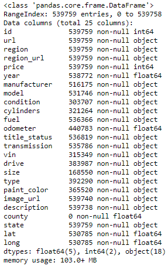
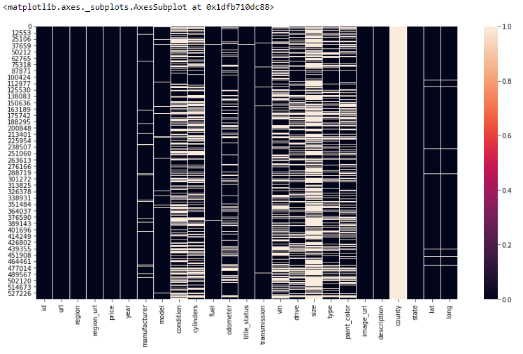
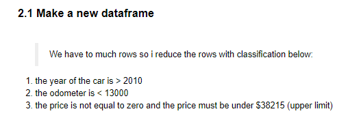
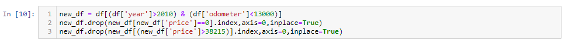
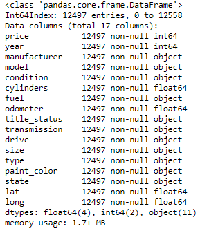
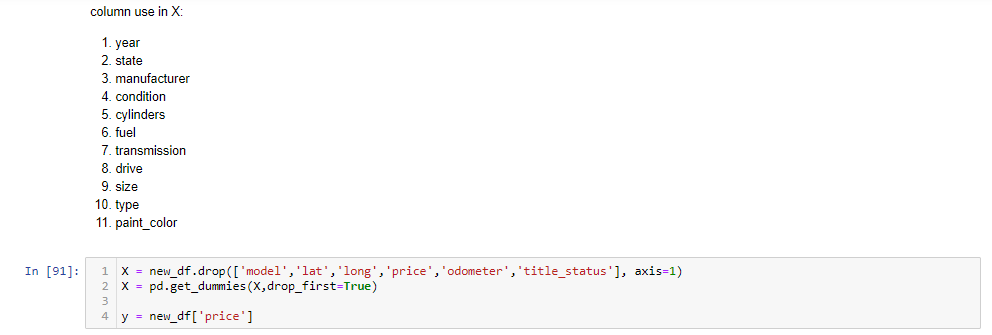

# Project Akhir Job Connector Data Science "Used Car Price Prediction"
by Jaka Galih Febrian

# 1. Dataset and Data Cleaning
Context

Craigslist is the world's largest collection of used vehicles for sale, yet it's very difficult to collect all of them in the same place. I found this dataset from kaggle.com whici is this dataset built from a scraper for a school project and expanded upon it later to create this dataset which includes every used vehicle entry within the United States on Craigslist.

Content

This data is scraped every few months, it contains most all relevant information that Craigslist provides on car sales including columns like price, condition, manufacturer, latitude/longitude, and 18 other categories. For ML projects, consider feature engineering on location columns such as long/lat. For previous listings, check older versions of the dataset.

Feature in dataset:

1. id = entry ID
2. url = listing URL
3. region = craigslist region
4. region_ur = lregion URL
5. price = entry price
6. year = entry year
7. manufacturer = manufacturer of vehicle
8. model = model of vehicle
9. condition = condition of vehicle
10. cylinders = number of cylinders
11. fuel = fuel type
12. odometer = miles traveled by vehicle
13. title_status = title status of vehicle
14. transmission = transmission of vehicle
15. vinvehicle id = entification number
16. drive = type of drive
17. size = size of vehicle
18. type = generic type of vehicle
19. paint_color = color of vehicle
20. image_url = image URL
21. description = listed description of vehicle
22. county = useless column left in by mistake
23. state = state of listing
24. lat = latitude of listing
25. long = longitude of listing

we can see the df.info() and null values in dataframe:
1. dataframe info:

2. null values:

<b>after that i make a new data frame:</b>

this is the final dataset after doing data cleaning:

# 2. Data Preprocessing
before make a machine learning your dataset must be numerical type, because machine learning can only process data type numerical. i change data type from my dataset using pd.get_dummies.

